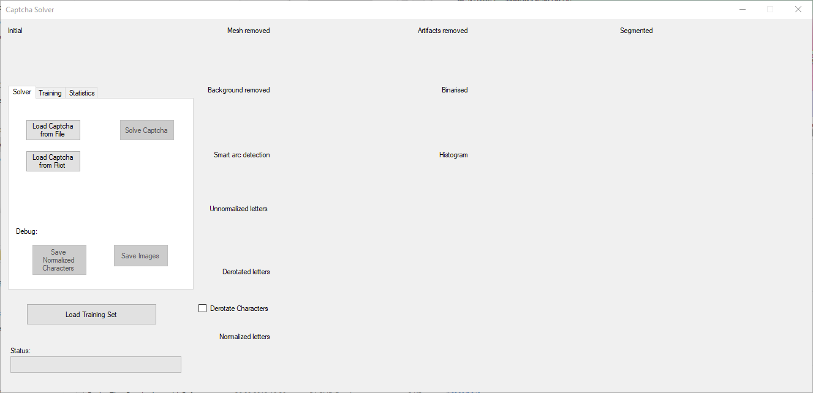
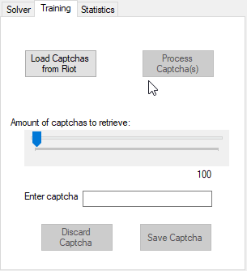
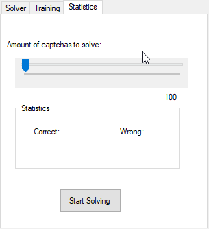

# CaptchaSolver
This program is supposed to solve Captchas from the Riot Games Webpage.
For that the OpenCV library is used. The images are preprocessed first,
then put through a Machine Learning algorithm to guess the solution of the captcha.
In order to get good results a training set has to be generated first.

